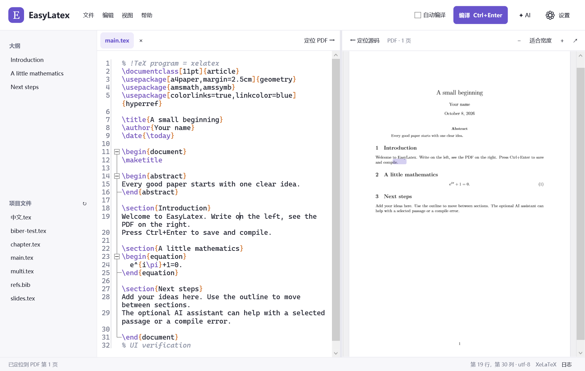

# EasyLatex

一个轻量 LaTeX 一键使用编译器。Windows 原生桌面界面，左侧写作、右侧真实 PDF 预览，并提供可选的 API AI 助手。

Windows x64 便携版：下载 [最新发行包](https://github.com/wensikai439/EasyLatex/releases/latest)，解压整个文件夹后双击 `EasyLatex.exe`。不需要另外安装 .NET 或完整 TeX 发行版。支持 Windows 10 2004+ / Windows 11。



## 使用

打开 `.tex` 或项目文件夹，按 **Ctrl+Enter** 保存并编译。也可以在「文件」菜单新建英文、中文或 Beamer 模板。编译产物集中保存在项目 `.easylatex/build`。

便携包附带 Tectonic 和三个内置模板所需的宏包、字体缓存，首次使用这些模板也能离线编译。新增宏包按需联网下载，随后复用缓存；设置里的「轻量引擎仅使用缓存」可显式关闭资源下载。已有 TeX Live / MiKTeX 会自动检测。需要 Biber、LuaLaTeX 或复杂自定义构建的项目，使用完整 TeX 发行版。

常用功能：多文件标签、大纲、语法高亮、代码补全、环境片段、折叠、查找替换、注释、引用键补全、错误跳转、PDF 缩放、SyncTeX、PDF 导出、中文与演示文稿模板、未保存内容恢复。

自动编译开关会在停止输入后自动保存并构建已保存的文件。手动模式始终可用。中文模板使用 XeLaTeX / Tectonic 和 Fandol 字体，不需要先寻找中文字库。

| 常用操作 | 快捷键 |
| --- | --- |
| 保存并编译 / 取消编译 | Ctrl+Enter |
| 查找 / 替换 | Ctrl+F / Ctrl+H |
| 注释 / 取消注释 | Ctrl+/ |
| 源码定位 PDF | Ctrl+J |
| PDF 定位源码 | 双击 PDF 正文，或 Ctrl+点击 PDF |
| 缩放预览 | Ctrl+滚轮 |
| 专注写作 | F11 |
| 撤销，包括 AI 修改 | Ctrl+Z |

左右工具栏提供「定位 PDF →」和「← 定位源码」按钮。源码定位使用光标位置，并在 PDF 中标出对应内容；点击「定位源码」后选择 PDF 正文，会打开对应文件并选中所在行，按 Esc 可取消。编译后继续插入或删除行也会按源码版本映射位置；新增的内容需编译后才出现在 PDF 中。重新编译同一个文档会保留阅读位置。

完整便携包约 **118 MiB 下载、190 MiB 解压**，包含 .NET、编译引擎与模板资源。大小指磁盘空间，运行内存随文档、缩放和 Windows 环境变化。0.2.0 的测试与打包取舍见 [验收记录](docs/verification.md)。

## AI

设置中填写兼容 OpenAI Chat Completions 的 API 根地址、模型名称和密钥。例如根地址为 `https://api.openai.com/v1`，本机模型可以使用 `http://localhost:11434/v1`。需要用户自己选择服务和模型，可能产生该服务的费用。

点击发送时才上传选区或当前文件及编译错误；不会自动上传其他项目文件。密钥保存到 Windows 凭据管理器。AI 提出可核对的修改，校验定位与重叠后由用户应用，再实际编译验证。按 Ctrl+Z 可撤销。

已通过本机 HTTP 模拟服务验证请求、错误响应、超时、取消、修改预览、应用后编译和撤销。外部模型的实际表现取决于你配置的服务；本次没有使用付费 API 密钥进行外部模型评估。

## 开发

要求 Windows 10 2004+ / Windows 11、.NET 10 SDK。

```powershell
./scripts/bootstrap.ps1       # 下载校验后的官方轻量编译引擎
./scripts/bootstrap.ps1 -WarmCache # 准备并离线验证三个模板的资源
./scripts/build.ps1           # 构建
./scripts/build.ps1 -Verify   # 真实编译及 WPF 界面验证
./scripts/build.ps1 -Publish  # 自包含便携包
```

开发工具在 `.tools`，构建与验证产物在 `artifacts`，都不提交到 Git。

实际验收范围与记录见 [docs/verification.md](docs/verification.md)，设计依据与参考项目见 [docs/design.md](docs/design.md)。MIT 开源，第三方组件见 [THIRD_PARTY_NOTICES.md](THIRD_PARTY_NOTICES.md)。
