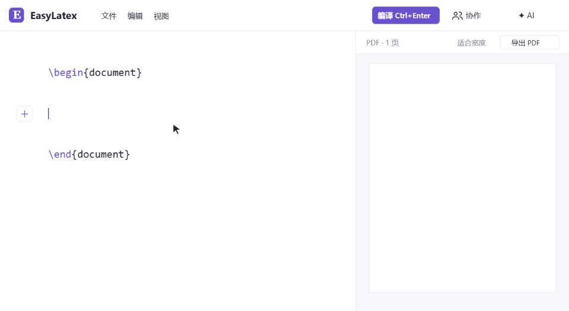
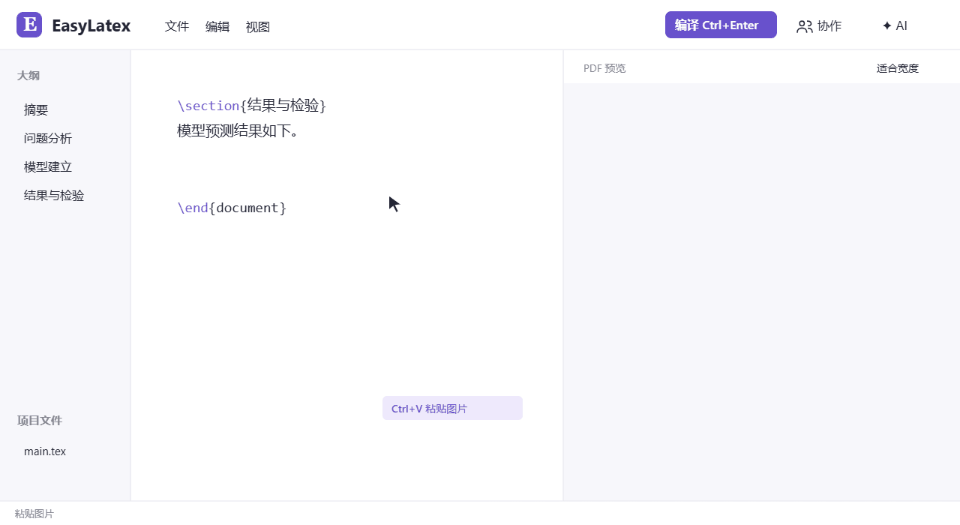
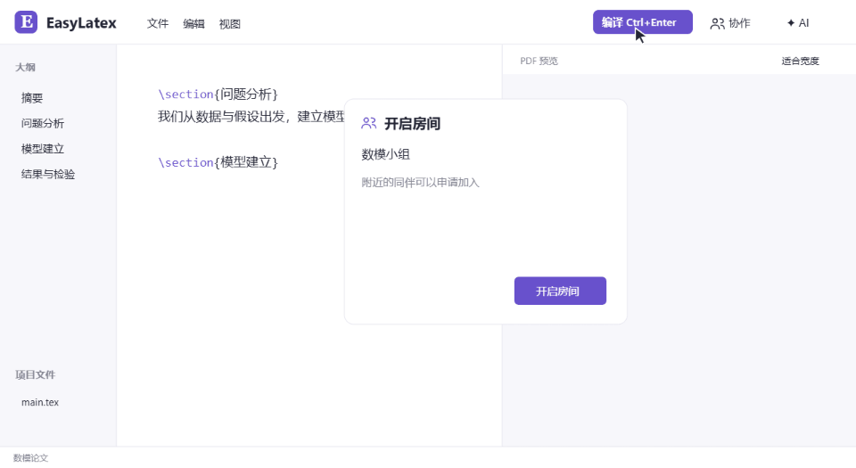
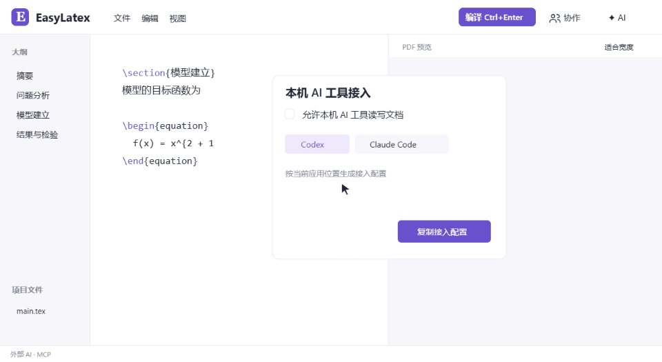

<h1 align="center">EasyLatex</h1>

<strong>专为数学建模打造的轻量 LaTeX 一键编译器</strong>

常用模块一键插入，图片直接粘贴，源码与 PDF 双击互跳，支持局域网协作和 AI 修改、编译。

  <a href="https://easylatex.upbeat-koala-8310.chatgpt.site">官网</a>
  ·
  <a href="https://github.com/wensikai439/EasyLatex/releases/download/v0.3.0-preview.10/EasyLatex-0.3.0-preview.10-win-x64.zip">下载 Windows 版</a>

## 01 · 常用模块，点击即用

面向数模团队的论文手：空行旁显示 **＋**，悬停展开摘要、章节、公式、三线表和图片。点击生成 LaTeX 代码，直接填写内容，不必先记住这些模块的命令。

有内容的行显示块类型，悬停即可切换正文与标题；选中文字可加粗、斜体或调整字号。插入和改格式后自动更新预览，首次使用先保存文件。

三线表可悬停选择行列。新插入的代码高亮 **6 秒**，位置一眼可见。

**图片直接粘贴。** 修改文件名，按章节提示选择插入位置；应用保存图片到 `figures/`，生成代码并按正文顺序排版。

## 02 · 局域网联机，一起写

房主开启房间，同伴从附近房间申请加入，确认后共同编辑。

章节、参考文献和图片在同一个项目里同步。看见彼此的光标，各自撤销自己的修改；断线继续本地写，重连后合并。

## 03 · 让 Codex、Claude Code 操控编译器

通过 **MCP** 连接 EasyLatex，直接告诉 AI 要做什么：

> 修复当前公式的语法，保留正文，然后编译并检查错误。

AI 可以读取文稿与错误、修改源码、插入常用模块，调用 EasyLatex 编译。应用提供 Codex、Claude Code、DeepSeek Harness、WorkBuddy 的接入配置。

也可直接在应用内填写 API 地址、模型和密钥，使用支持 Chat Completions 的服务。应用内助手先展示修改建议，由你审阅后应用。

[AI 工具接入说明](docs/ai-tools.md)

以上动画为操作流程示意，不作为编译或同步耗时的测量结果。

## 使用

1. 下载并解压**整个文件夹**，双击 `EasyLatex.exe`。
2. 打开 `.tex` 或项目文件夹；也可从「文件」新建数模写作模板。
3. 按 **Ctrl+Enter** 保存并编译，左侧编辑，右侧查看 PDF。

双击源码或 PDF 文字即可双向定位。编译日志留在后台，界面不自动弹出日志窗口。

同一款应用也提供数学讲义模板，以及定义、例题、练习等常用模块。

## 当前预览版

**0.3.0-preview.10 · Windows x64**，支持 Windows 10 2004+ / Windows 11。

附带轻量编译引擎与五个内置模板的资源缓存，无需另装 .NET。内置模板可离线编译；新增宏包首次可能需要联网。需要 Biber、LuaLaTeX 或复杂自定义构建的项目可使用已有 TeX Live / MiKTeX。

联机需要电脑可以互访；访客网络隔离或防火墙可能阻止连接。本机多进程协作、断线恢复和压力测试已验证，真实双机体验仍待验收。MCP 协议与接入配置已测试，WorkBuddy 等客户端的完整模型任务尚未逐一联调。
